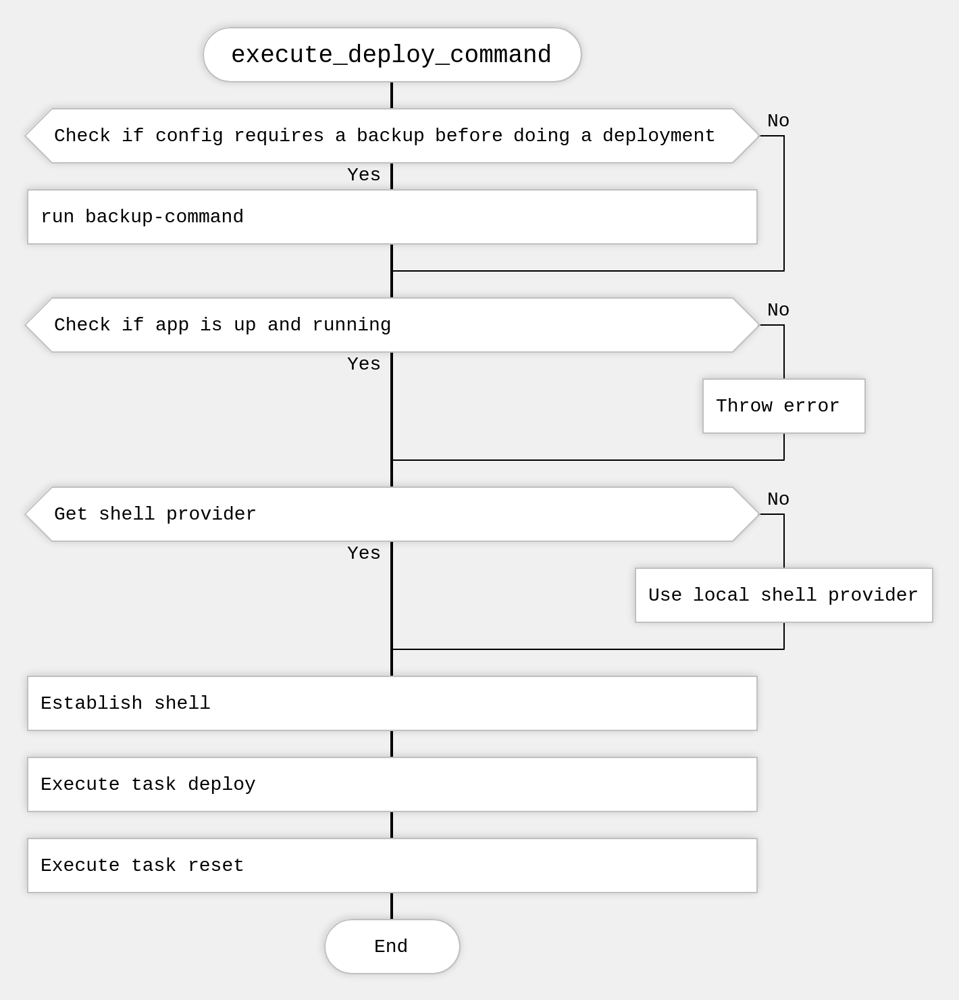
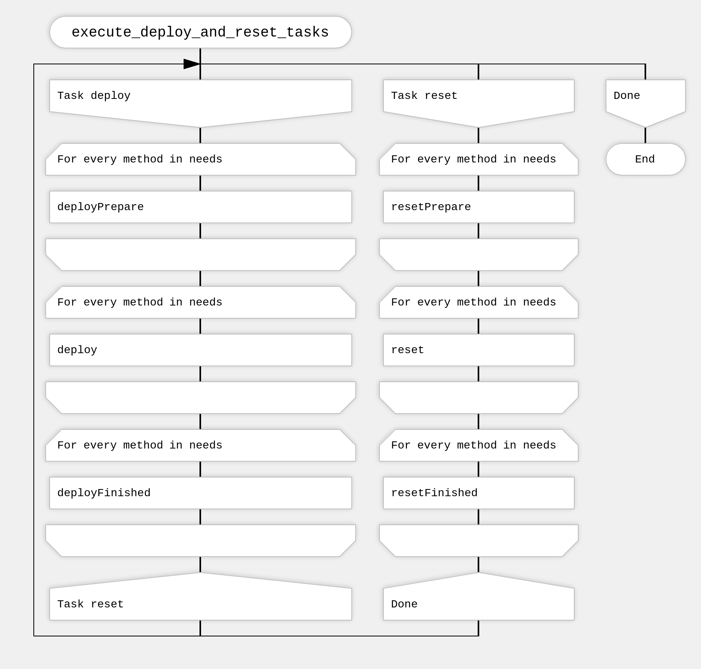
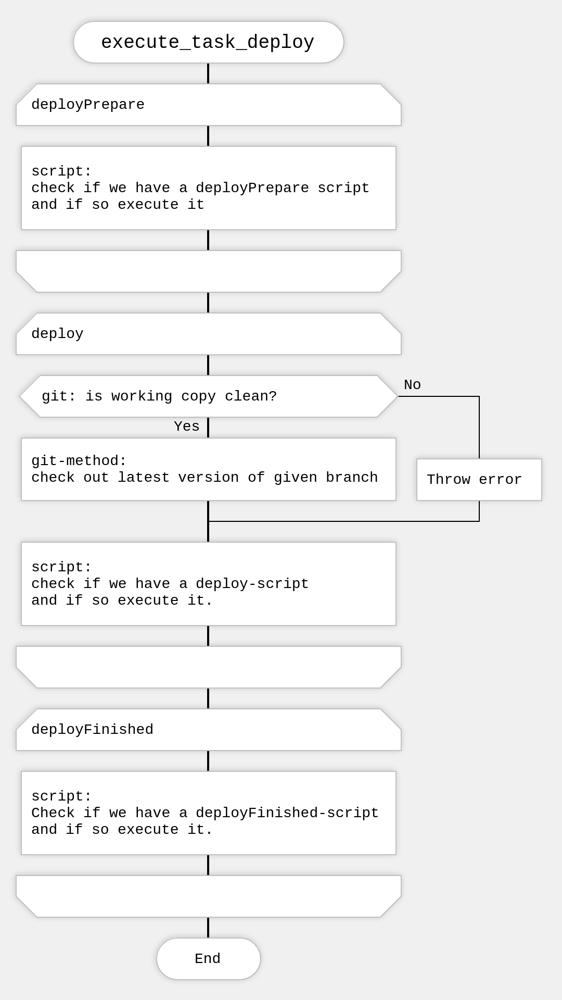

# Introduction and overall architecture

## Introduction

Phabalicious stores **all project related configuration for tooling and setup in a single place** per project, the so-called `fabfile.yaml` which lives in the root-folder of a project. It documents all available installations of a given application (e.g. local, dev-, stage- and prod-instances)

Phabalicious "knows" **how to interact with certain types of applications** like drupal, laravel etc. and offers the developer a handful of useful commands to interact with these applications like deploying a new version of the application to a remote instance, getting a database from a dev-environment or getting a shell on a remote instance **regardless where the application is hosted**. 

Phabalicious knows also **how to handle the evironment** which is hosting the application, be it your local computer, a dockerized environment, a remote server or a kubernetes cluster. That helps the developer to control the application.

Phabalicious' **open architecture and its flexibility makes it easy to extend the core functionality** to support hard-to-integrate environments e.g. ssh jump hosts, docker on remote instances etc. **The scaffolding system helps generating host-specific configuration files** e.g. for docker-compose or kubernetes or by scaffolding whole new projects. 

Phabalicious can be used with a multitude of applications, hosting environments and can be tightly integrated with e.g. Continuous Deployment Tooling. 

Inheritance and remote configuration files allows teams to store configuration centrally and override and extend it on a per project- and host-level which helps in minimizing outdated configuration.

## Architecture

### Naming things

Phabalicous is using special naming to differentiate things better. Here's short explanation:

* A _host_ is an entry in the fabfile under the `hosts`-section which encapsulates all configuration under a unique name.
* A _command_ is the command you execute by running phab, e.g. `phab list:hosts`. Here the _command_ is `list:hosts`. A _command_ is usually executed against a given _host_-configuration
* Every _host_ declares a list of `needs`. A need will be fullfilled by an existing _method_ implemented by phabalicious. One _host_ might need the functionality of the `script`-method, and of the `ssh`-method. [Here's](../configuration.md#needs) a list of all implemented methods
* Some methods provide a _shell-provider_. A shell provider knows "how" to get a shell for a _host_, e.g. by starting a ssh-connection.
* Every _method_ requires different config-parameters from the _host_-configuration, which will be validated on startup.
* Every _command_ will execute one or multiple _tasks_. Every needed _method_ can now react to a given _task_ and do its work. Every enabled _method_ will also be consulted when preparing the execution of a task, and when the task is finished.

### How a command is executed
Here's a series of diagrams showcasing what happens exactly behind the scenes when executing the _command_ `deploy`  with the following host-config:

```yaml
hosts:
  test:
    needs:
	  - ssh
	  - git
	  - mysql
	  - script
    ...
```

1. Check if a backup is required
2. Run the _task_ `deploy` and `reset` against all needed _methods_



A closer look into how _tasks_ are executed with _methods_.
1. First run the `deployPrepare`-_task_ against all needed methods
2. Run the `deploy`-_task_ against all needed methods
3. Finally run the `deployFinished`-_task_ against all needed methods
4. Do the same for the `reset`-_task_



Let's zoom into the `deploy`-task:



This should give you an overall idea how things are connected in phabalicious. Also with this approach it is very easy to combine different methods together (e.g. a `laravel`-application with a `sqlite`-database) and to extend the functionality with custom scripts.

### The fabfile.yaml

The fabfile is the central place for all project related configuration. It [can inherit configuration](../inheritance.md) from local and remote files to include centralized configuration very easily which helps a team to prevent copy-pasta which leads to outdated configurations on the long run. Local overrides allows the developer to adapt the global project configuration to his particular needs.

The fabfile contains also all [custom scripts](../scripts.md) which can use pattern-replacements to inject configuration values into the running script to enhance reusability of code. Scripts can also be invoked before, on, or after the execution of specific _tasks_.

### The scaffolder

Phabalicious contains a powerful [scaffolder](../scaffolder.md), which can support the developer in creating [new projects](../app-scaffold.md) from scratch, alter existing projects in a given way or create tailored configuration- or definition-files for other tools like `docker-compose` or `kubectl`. The twig-template-engine allow the developer to inject specifc configuration into the scaffolded files.

