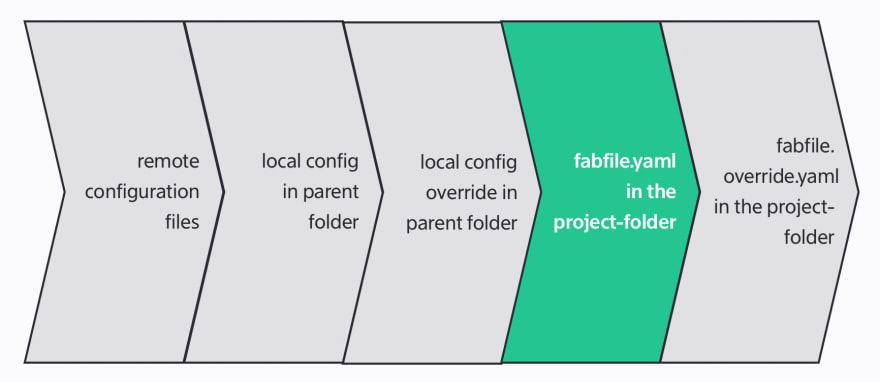
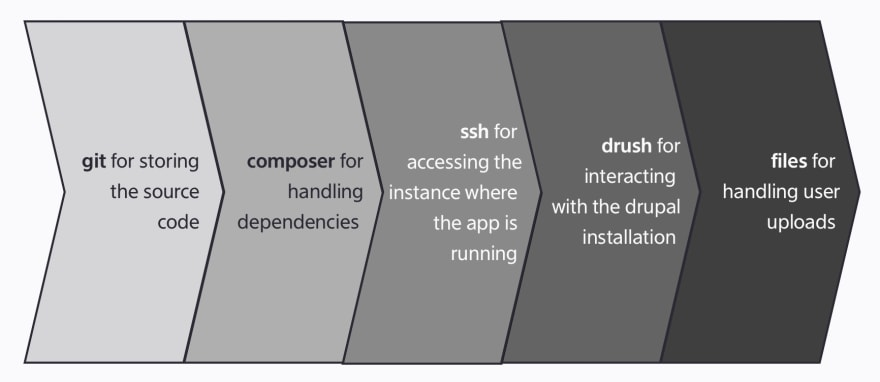
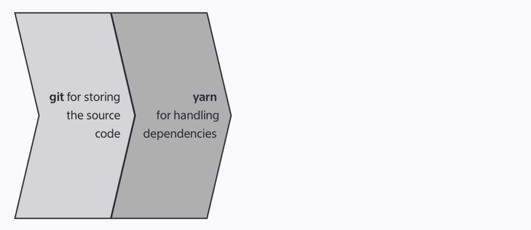

#A short introduction into phabalicois

## What is this all about

Phabalicious helps developers in their daily live to interact with their projects. For example setting it up locally and get it running, getting data from a remote instance, inspect a remote instance, etc.

It is a command line utility written in PHP/Symfony which can be downloaded from [github.com/factorial-io/phabalicious](https://github.com/factorial-io/phabalicious) and installed on your local computer.

All project-relevant configuration is stored in the `.fabfile.yaml` which is part of your project.

## The key concepts of phabalicious are

Let's try to clarify some terms and key-concepts before we dive into the demonstration:

### Configuration
One central place to store all project relevant configuration as part of the project, is the `fabfile.yaml`.

The project-configuration is composable and tinkerable from multiple, even remote sources. Here's a schema describing the inheritance-mechanism from phabalicious:



It describes the whole inheritance schema available with phabalicious. You can inject global configuration available somewhere on a remote server, parts overridden from configuration-files from your local and merged with the actual project-configuration in your fabfile.yaml.

### Methods
Methods know how to deal with certain aspects of your application, e.g. how to interact with a database, how to install your dependency or how to reset or a Drupal installation.

Here's an example for a typical Drupal application:



On the other hand, a vuejs application might look like this:



### Shells
Shells can interact with a multitude of environments: local or remote servers, even behind jump hosts, dockerized or kubernetized apps. As long as phabalicious can create a shell to your application it can interact with it.

### Scripts
Phabalicious makes it easy to create and modify scripts which can be executed on different installations and from mostly every stage of your task execution. That means you can reuse the same script to configure your environment regardless where it is deployed.

### Scaffolders
Phabalicious can support you in the process of automating cumbersome tasks, like scaffolding new projects from a set of template files, or by scaffolding project- and configuration-specific files like env-files. You can even use the stored project-configuration and pass it to the scaffolder.

### Secrets
Secrets like passwords, credentials or API-keys must not be checked into repositories. Phabalicious can consume secrets like passwords or API keys from environment variables, the command line or directly vie [1password cli](https://1password.com/downloads/command-line/) or [1password connect](https://support.1password.com/secrets-automation/).

## Let's try it out.

For this demo we will install phabalicious in the current folder so it's easy for you to remove the app again. You can find the installation documentation [here](https://docs.phab.io/installation.html). Let's create a demonstration folder:

```bash
mkdir phab-demonstration
cd phab-demonstration
curl -L "https://github.com/factorial-io/phabalicious/releases/download/3.7.5/phabalicious.phar" -o phab
chmod +x phab
./phab --version
```

This should print out

```shell
phabalicious 3.7.5
```

Congratulations! Phab is installed and working! (If not please have a look at the [system requirements](https://docs.phab.io/installation.html))

## A simple vue-based example

Let's start with a simple example using a vue hello-world project. First of all we need to create the vue project. Let's assume you are still in the `phab-demonstration` folder:

```shell
vue create hello-world
cd hello-world
```

vue should have scaffolded a new project into the folder `hello-world`.

Let's start with a simple host-config and a script:


