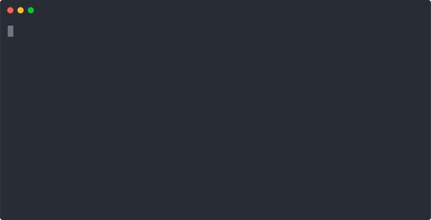

# A short introduction into phabalicious

## What is this all about?

Phabalicious helps developers in their daily live to interact with their projects. For example setting it up locally and get it running, getting data from a remote instance, inspect a remote instance, etc.

It is a command line utility written in PHP/Symfony which can be downloaded from [github.com/factorial-io/phabalicious](https://github.com/factorial-io/phabalicious) and installed on your local computer.

All project-relevant configuration is stored in the `.fabfile.yaml` which is part of your project.

## The key concepts of phabalicious

Let's try to clarify some terms and key-concepts before we dive into the demonstration:

### Configuration
One central place to store all project relevant configuration as part of the project, is the `.fabfile.yaml`.

The project-configuration is composable and tinkerable from multiple, even remote sources. Here's a schema describing the inheritance-mechanism from phabalicious:


It describes all possible ways to inherit data with phabalicious. You can inject global configuration available somewhere on a remote server, parts overridden from configuration-files from your local and merged with the actual project-configuration in your fabfile.yaml.

### Methods
Methods know how to deal with certain aspects of your application, e.g. how to interact with a database, how to install your dependency or how to reset or install a Drupal installation.

Here's an example for a typical Drupal application:


On the other hand, a vuejs application might look like this:


### Shells
Shells can interact with a multitude of environments: local or remote servers, even behind jump hosts, dockerized or kubernetized apps. As long as phabalicious can create a shell to your application it can interact with it. So a perfect fit for your local dev-environment and your production hosting.

### Scripts
Phabalicious makes it easy to create and modify scripts which can be executed on different instances and from mostly every stage of your task execution. That means you can reuse the same script to configure your environment regardless where it is deployed.

### Scaffolders
Phabalicious can support you in the process of automating cumbersome tasks, like scaffolding new projects from a set of template files, or by scaffolding project- and configuration-specific files like env-files. You can even use the stored project-configuration and pass it to the scaffolder.

### Secrets
Secrets like passwords, credentials or API-keys must not be checked into repositories. Phabalicious can consume secrets like passwords or API keys from environment variables, the command line or directly via [1password cli](https://1password.com/downloads/command-line/) or [1password connect](https://support.1password.com/secrets-automation/).

## Let's try it out.

For this demo we will install phabalicious in the current folder so it's easy for you to remove it later. You can find the installation documentation [here](https://docs.phab.io/installation.html). Let's create a demonstration folder:

```bash
mkdir phab-demonstration
cd phab-demonstration
curl -L "https://github.com/factorial-io/phabalicious/releases/download/3.7.5/phabalicious.phar" -o phab
chmod +x phab
./phab --version
```

This should print out

```shell
phabalicious 3.7.5
```

Congratulations! Phab is installed and working! (If not please have a look at the [system requirements](https://docs.phab.io/installation.html))

## A simple vue-based example

Let's start with a simple example using a vue hello-world project. First of all we need to create the vue project. Let's assume you are still in the `phab-demonstration` folder:

```shell
vue create hello-world
cd hello-world
```

Vue should have scaffolded a new project into the folder `hello-world`.

Let's start with a simple host-config:

```yaml
name: Vue hello world example

needs:
  - git
  - yarn

host:
  local:
    rootFolder: .
    yarnBuildCommand: build

```
Running `../phab list:hosts` should list your config. One of the most often used commands is `reset`, which will make sure, that your local app respects the latest changes from your code and configuration. Usually you run the `reset`-command after you switched to a new branch or pulled new code into your local installation.



As we can see in the screen-recording phab will build the yarn application when executing the `reset`-command. It's because of our `needs`-declaration in the fabfile.yaml

Let's add a new script for our custom needs:

```yaml
name: Vue hello world example

needs:
  - git
  - yarn
scripts:
  serve:
    - "#!yarn serve"
host:
  local:
    rootFolder: .
    yarnBuildCommand: build
```

Now lets try this out:


Let's add docker into the mix. Let's create a new configuration, which will build a docker image from our hello-world example and run it. Here's the adapted `.fabfile.yaml`, notice the new host-configuration and a list of docker-tasks:

```yaml
name: Vue hello world example

needs:
  - git
  - yarn

scripts:
  serve:
    - "#!yarn serve"

dockerHosts:
  dockerized:
    runLocally: true
    rootFolder: .
    # tasks contains a list of docker subtasks, basically small scripts which can consume configuration
    # from the current host and be executed via phab docker <task>
    tasks:
      stop:
        - docker stop %host.docker.name% || true > /dev/null
      rm:
        - execute(docker, stop)
        - docker rm %host.docker.name% || true > /dev/null
      build:
        - docker build -t vue-hello-world .
      run:
        - execute(docker, build)
        - execute(docker, rm)
        - docker run -d -p 8080:8080 --name vue-hello-world vue-hello-world

hosts:
  local:
    rootFolder: .
    yarnBuildCommand: build

  dockerized:
    inheritsFrom: local
    shellProvider: docker-exec
    needs:
      - git
      - yarn
      - docker
    docker:
      configuration: dockerized
      name: vue-hello-world
      projectFolder: .
```

This is our dockerfile:

```
FROM node:14
ADD . /app
WORKDIR /app
RUN yarn install
CMD yarn serve
```

So, let's try this out:


Let's recap what is happening behind the scene:
1. `phab docker run` will execute the script snippet from the fabfile section `dockerHosts.dockerized`. The script itself executes another phab command, namely `docker build` which will trigger the compilation of the docker image.
2. the second line `execute(docker, rm)` will execute the docker task `rm`, which will stop and remove any pending docker container.
3. After that the docker container will be started.
4. Now you should be able to get the output of the app from http://localhost:8080

Now, let's get into the container and inspect the app:


 ### Summary

This short intro showed you some key concepts of phabalicious:

- Modular `methods` to adapt the configuration to the needs of your application (in our short example namely `yarn` and `docker`)
- How scripts and the replacement-patterns work together to use host-specific configuration in scripts
- How we can interact with our application with the `shell`-command

Hopefully this gave you a rough idea what phabalicious is capable of. Jump into the documentation to find out more, there is also a more theoretical blog-post about the [architecture of phabalicious](./architecture.md). Or wait for the next episode where we try to add a fabfile to an existing drupal project.
